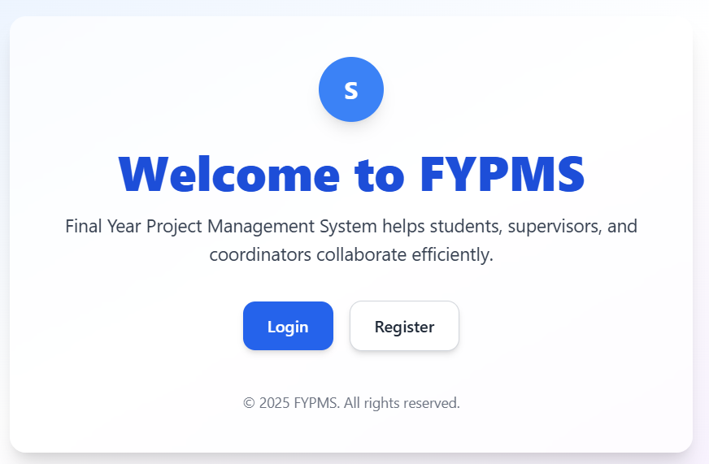
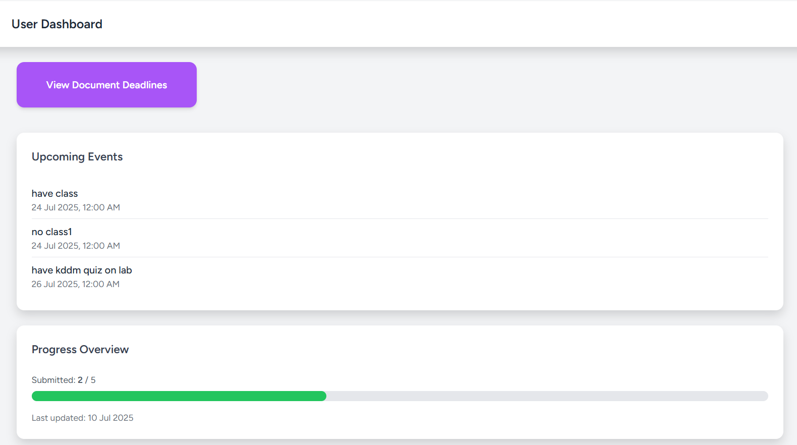

# FYPMS - Final Year Project Management System

<p align="center">
  
</p>

## About This Project

The Final Year Project Management System (FYPMS) is a comprehensive web application built with Laravel to streamline and manage the entire process of final year projects for educational institutions. The system facilitates communication and collaboration between students, supervisors, and administrators throughout the FYP lifecycle.

## Screenshots

### Welcome Screen

*The welcome page introduces users to FYPMS with login and registration options.*

### Student Dashboard

*Student dashboard showing upcoming events, document submission progress, and quick access to system features.*

## Key Features

### For Students
- **Supervisor Selection**: Browse and request supervisors for project guidance
- **Document Management**: Upload, track, and manage project documents and submissions
- **Calendar Integration**: Organize meetings and project milestones with an interactive calendar
- **Progress Tracking**: Monitor project progress and receive notifications about deadlines
- **Chat System**: Direct messaging with supervisors through the integrated chat feature
- **Thesis Repository**: Access to previous year's theses for reference

### For Supervisors
- **Student Management**: Track and monitor assigned students' progress
- **Document Review**: Access and review student submissions
- **Calendar Management**: Schedule and manage meetings with students
- **Approval System**: Approve or reject student registration requests
- **Communication Tools**: Dedicated messaging system for student-supervisor communication

### For Administrators
- **User Management**: Create and manage student and supervisor accounts
- **Department Configuration**: Organize users by academic departments
- **Document Requirements**: Set up document submission requirements and deadlines
- **Announcement System**: Publish important announcements to all users
- **Reporting Tools**: Generate and export reports on student registrations and progress
- **Archive Management**: Archive graduated students' records and theses

## Technology Stack

- **Framework**: Laravel 12.x
- **Database**: SQLite (default), supports MySQL, PostgreSQL
- **Frontend**: Blade templates with Tailwind CSS
- **Authentication**: Laravel Breeze
- **PDF Generation**: Laravel DomPDF
- **Real-time Chat**: Chatify integration
- **Calendar**: FullCalendar.js integration

## Installation

```bash
# Clone the repository
git clone [repository-url]

# Navigate to the project directory
cd fyp-management-system

# Install PHP dependencies
composer install

# Install frontend dependencies
npm install

# Copy environment file
cp .env.example .env

# Generate application key
php artisan key:generate

# Run database migrations
php artisan migrate

# Seed the database with initial data
php artisan db:seed

# Build frontend assets
npm run dev

# Start the development server
php artisan serve
```

## System Requirements

- PHP >= 8.2
- Composer
- Node.js and NPM
- SQLite or other supported database system

## License

This project is licensed under the [MIT License](https://opensource.org/licenses/MIT).

## Acknowledgements

Built with [Laravel](https://laravel.com), the PHP framework for web artisans.
